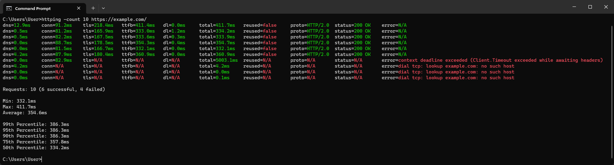

# httping

A ping-like tool for HTTP(S). Written in Go.



## Install

### Precompiled binaries

You can download precompiled binaries for Windows (amd64) and Linux (amd64,
arm64) [here](https://github.com/GitRowin/httping/releases).

### From source

Requires Go 1.21 or higher.

```
git clone https://github.com/GitRowin/httping.git
cd httping
go install
```

## Usage

```
Usage: httping [options] <url>
  -count uint
        Number of requests to send
  -delay uint
        Minimum delay between requests in milliseconds (default 1000)
  -disable-compression
        Whether to disable compression
  -disable-h2
        Whether to disable HTTP/2
  -enable-keep-alive
        Whether to use keep-alive
  -no-new-conn-count
        Whether to not count requests that did not reuse a connection towards the final statistics
  -timeout uint
        Request timeout in milliseconds (default 5000)
```

Example: `httping -count 10 -disable-compression -timeout 1000 https://example.com/`
